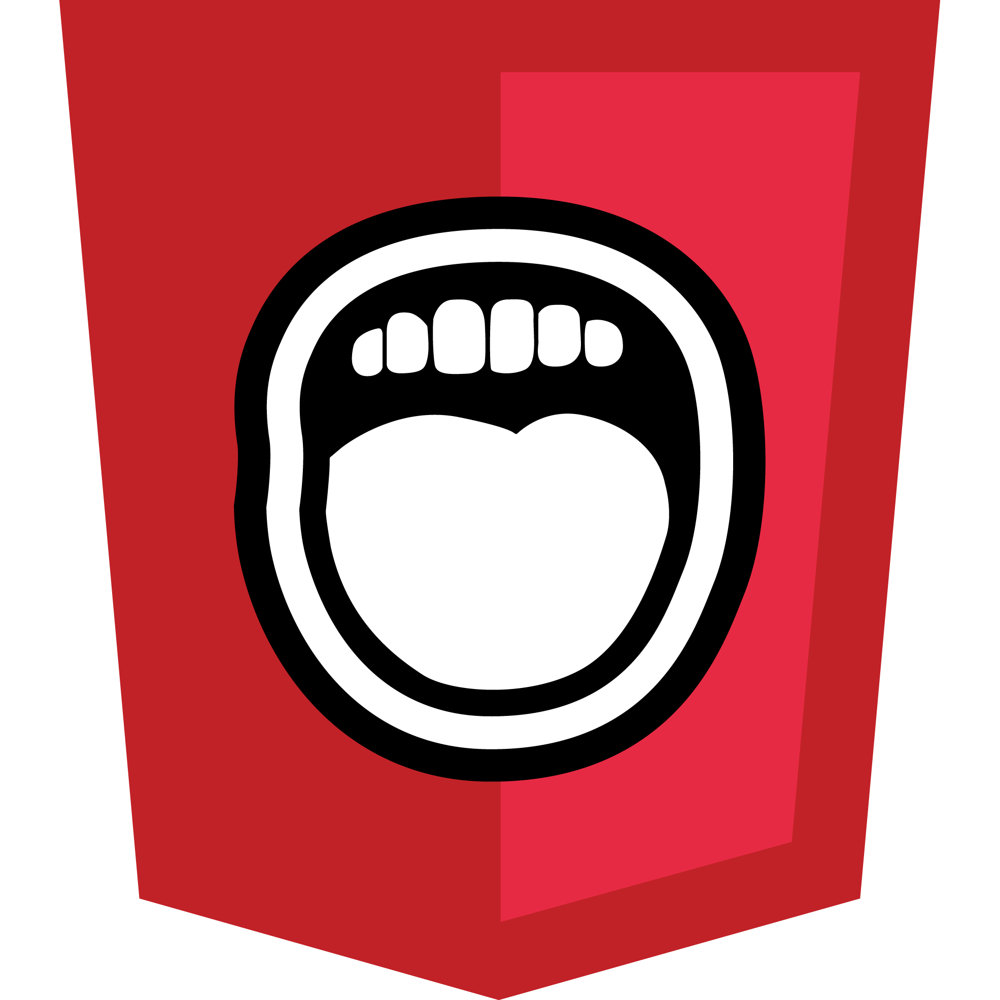

# Game Exemplo: Número Secreto

## 👨🏻‍💻 [Abrir Projeto](https://game-exemple-secretnumber.vercel.app)

## 📝 Introdução

Este jogo foi desenvolvido para desafiar o jogador a adivinhar um número secreto, gerado automaticamente, que está dentro do intervalo de 1 a 10.

## 💡 Sobre

Este jogo foi desenvolvido utilizando HTML e CSS, garantindo uma experiência responsiva em todos os dispositivos. Com o auxílio da linguagem de programação JavaScript, implementamos a lógica necessária para definir as regras e funções essenciais para o funcionamento correto da aplicação:

🪧 Mensagem na Tela: Na tela, mensagens dinâmicas se adaptam à medida que o jogador tenta adivinhar o número secreto. Além disso, incorporamos a ferramenta `🎙ResponsiveVoice`, que proporciona uma experiência mais interativa e acessível ao narrar as mensagens para o jogador.

▶️ Botão Chutar: Compara o valor digitado pelo jogador com o número gerado automaticamente. 
Se errar.. o jogador é informado do erro, as informações digitadas são limpas e ele é incentivado a tentar novamente. 
Se acertar.. recebe uma mensagem de acerto e o botão 'Novo Jogo' é habilitado.

↩️ Botão Novo Jogo: Só fica disponível quando o jogador acerta. Ao ser pressionado, ele reseta as mensagens na tela, limpa o campo digitado e gera um novo número para ser adivinhado pelo jogador.

## 📚 Conhecimentos

Para estudo e aplicação do projeto, foi utilizado os conteúdos:

- [Lógica de programação: mergulhe em programação com JavaScript](https://cursos.alura.com.br/course/logica-programacao-mergulhe-programacao-javascript)
- [Lógica de programação: explore funções e listas](https://cursos.alura.com.br/course/logica-programacao-funcoes-listas)

## 🤖 Tecnologias

  
  
  
  
  

---

- `HTML`: Através do HTML realizamos o desenvolvimento da estrutura, assim como definimos e organizamos o conteúdo de forma que seja facilmente interpretado pelos navegadores web.

- `CSS`: O CSS nos permite controlar a aparência e o layout do nosso jogo, proporcionando uma experiência visual atraente, responsiva e consistente para quaisquer dispositivos.

- `JavaScript`: O JavaScript é a linguagem de programação utilizada para tornar nossa página interativa, definindo as regras, cálculos e funções necessárias para automatizar e executar o projeto.

- `ResponsiveVoice`: Foi utilizado a ferramenta de síntese de voz baseada na web que permite adicionar funcionalidades de texto para fala aos seus aplicativos e sites. O que nos permitiu integrar facilmente a conversão de texto em fala no nosso jogo, tornando a interação com os usuários mais acessível e inclusiva.

- `Devicon`: Utilizei a coleção de ícones de alta qualidade do Devicon, justamente para representar os ícones das tecnologias utilizadas no GitHub, esse ícones são projetados para representar várias tecnologias e ferramentas de desenvolvimento de software.
---
**Desenvolvido por [Rodrigo Moraes](https://github.com/rodrigomoraesdev)**
